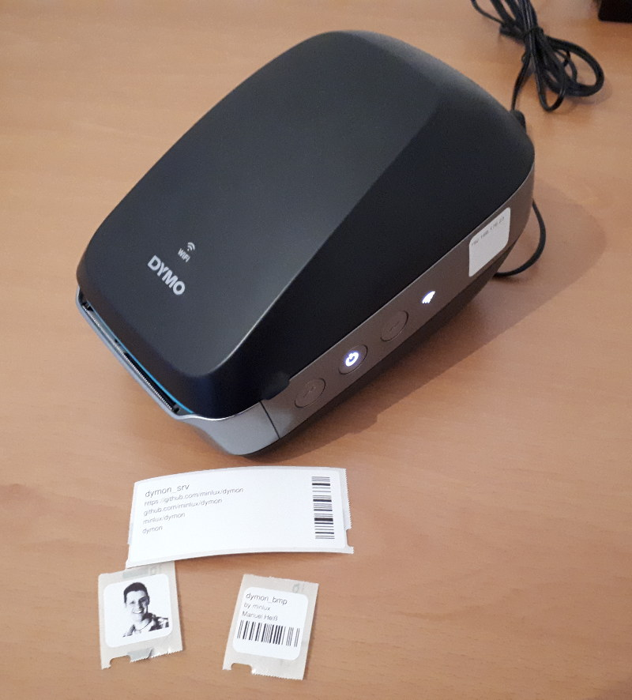
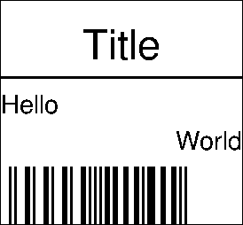

# dymon
Command line tools and printserver (webserver) for DYMO LabelWriter (Wireless, 450, 550).



This project implements 3 applications:
- `dymon_pbm` allows printing of labels from command line.
- `dymon_srv` implements a webserver, that allows printing of labels through a REST-API. In addition it serves a site (which is using this REST-API) that allows label printing from by a web form.
- `txt2pbm` is a little helper tool, to create a pbm file from text.


## Intro
2018 I bought DYMO's new wireless label printer (*LabelWriter Wireless*). I had the idea to print labels out of an (web)application
containing data like numbers and barcodes dynamically retrieved from a database.

My starting point was the DYMO's LabelWriter SDK. Unfortunately there was little information for LabelWriter Wireless. If found
*LabelWriter 450 Series Printers Technical Reference Manual* via Google but none for *LabelWriter Wireless*. I get in contact with
DYMO's support and asked for a *Reference Manual* for *LabelWriter Wireless* but I got only the one for *LabelWriter 450*.

The *Reference Manual* for *LabelWriter 450 Series Printers* had some useful information but not exactly that what I wanted to know. Searching
around the internet ended up in two interessting projects whose sourcecode contains additional informaiton:
- https://sbronner.com/dymoprint.html
- https://github.com/computerlyrik/dymoprint

Nevertheless I still didn't have all required information to "operatate" the *LabelWriter Wireless* out of my own application.
So it was time for *Wireshark* to capture the communication between the DYMO's label creater software *DYMO Label* and *LabelWriter Wireless*...
To make it short: Based on the information provided in the resouces noted above I managed it to figure out the majority of the TCP communication protocol.


## Findings
For communiction with the *LabelWriter Wireless* TCP port 9100 is used. This makes sense, because port 9100 is reserved for PDL (page description language)
data streams, used for printing to certain network printers. Communicatin is **NOT** encrypted.

The printer implements a kind of *ESC* protocol. The commands are similar as specified in *LabelWriter 450 Series Printers Technical Reference Manual* but not in all cases. Also there are commands, that
aren't described in this document.

Each command starts with `0x1B` followed by a "command selector byte" and optional parameter data. These parameter are little endian encoded.

The label itself is given by a bitmap "blob". In a preceeding header some meta information are defined. Among other things the width (number of columns) and height (number of rows) of the bitmap, the label length, print density, print quality...

The bits of the bitmap blob are mapped to label pixels row by row, column by column (Z)
* It starts in upper left corner with bit 7 of the first bitmap-byte.
* The next pixel (1st row, 2nd column) is followed by bit 6 ...
* There is a wrap around at the end of each row ...
* It ends in the lower right corner with bit 0 of the last byte.
* The bitmap blob seems to match the *pbm P4* format (see https://en.wikipedia.org/wiki/Netpbm_format)

> I just testes this with a label width that is a multipel of 8. So the wrap around is at a byte boundary, and there are no unused trailing bits in the blob. Don't know what happens if this isn't considered!?


## Protocol
Example for printing a 272x252 bitmap to a 25mm X 25mm label with 300x300dpi.

1. Open TCP connection

2. Get status of printer
   1. `0x1B, 0x41, 1` : **A** Send a TCP packet containing 3 bytes (2 byte command, 1 unknown byte)
   2. Receive reply from printer (32 bytes - see doc/cmd_status.md for status details)

3. Send label data

   1. Configure label settings
      1. `0x1B, 0x73, 1, 0, 0, 0` : **s** Session-Counter, 2 byte command, 32-bit value (meaning of counter unknown)
      2. `0x1B, 0x43, 0x64` : **C** Print-Density, 2 byte command, 1 byte value (0x64 ^= normal)
      3. `0x1B, 0x68` : **h** Printer in 300x300 dpi text mode
      4. `0x1B, 0x4D, 0, 0, 0, 0, 0, 0, 0, 0` : **M** Media/Paper-Type, 2 byte command, 8 byte value (8x0 ^= normal)

   2. Setup label
      1. `0x1B, 0x6E, 1, 0` : **n** Label index, 2 byte command, 16-bit value (meaning of index unknown)
      2. `0x1B, 0x44, 0x01, 0x02, 0xFC, 0, 0, 0, 0x10, 0x01, 0, 0` : **D** Bitmap spec, 2 byte command, 2 unknown bytes, 32-bit bitmap height, 32-bit bitmap width (height 252px = 0xFC ^= [0xFC, 0, 0, 0]; width 272px = 0x110 ^= [0x10, 0x01, 0, 0])

   3. Send bitmap "blob"

   3. Send "footer data" of label (last packet of blob - MSG_MORE = false)
      1. `0x1B, 0x47` : **G** Short form feed, 2 byte command
      2. `0x1B, 0x41, 0` : **A** Get status, 2 byte command, 1 unknown byte

4. Receive reply from printer (32 bytes - see doc/cmd_status.md for status details)

5. Continue with 3.2 to print the next label (of the same type as configured in 3.1 - but with diffrent content). Goto step 6 when done.

6. Send a TCP packet containing following data to output label
   1. `0x1B, 0x45` : **E** Line feed, 2 byte command
   2. `0x1B, 0x51` : **Q** Line tab, 2 byte command

7. Close TCP connection


## Implementation
Most of the application code relates to the creation of the bitmap (text and barcode). The actual code to interface with the *LabelWriter* can be found in the files in folder `dymon` and in `src/print.cpp`.

## Notes
- *Dymon* is an abstact class. There is a specialization for Windows and one for Linux. Those child classes only handles the TCP network access.
- To change the oriantation of the label, the bitmap must be rotated. The bitmap class in this project demostrates this.
- To get an idea how to change the label size/format have a look into `src/print.cpp`. There is an implementation for two different label formats with different orientation.


## How to build
Build process is based on CMake.

1. Create a build directory (e.g. `mkdir build`)
2. Within the build directory execute `cmake ..`
3. Within the build directory execute `make`


## Usage


### dymon_pbm

```
Print P4 portable bitmap on DYMO LabelWriter.

Usage: dymon_pbm
 [--help] [--version] [--usb=<DEVICE>] [--net=<IP>] [--model=<NUMBER>] [--copies=<NUMBER>] [--debug] <INPUT>

Options:
  --help                    Print help and exit
  --version                 Print version and exit
  --usb=<DEVICE>            Use USB printer device (e.g. '/dev/usb/lp1')
  --net=<IP>                Use network printer with IP (e.g. '192.168.178.23')
  --model=<NUMBER>          Model number of DYMO LabelWriter (e.g. '450')
  --copies=<NUMBER>         Number of copies to be printed [default: 1]
  --debug                   Enable debug output
  <INPUT>                   PBM file to be printed
```

Note: At least for LabelWriter 450, it is mandotory to set `--model`<br>
Note: On Windows you have to specify the `--usb` *DEVICE* by means of vendor-/product-id. E.g. `vid_0922` or more specific `vid_0922&pid_0028`.


**Examples:**

In folder `doc` you can find some example files that can be printed (on the respective lables) like this:

```
./dymon_pbm --net 192.168.178.23 ../doc/manu_25x25.pbm
./dymon_pbm --usb /dev/usb/lp0   ../doc/eagle_25x25.pbm     //Linux
./dymon_pbm --usb vid_0922       ../doc/eagle_36x89.pbm     //Windows
```


### dymon_srv

```
Printserver for DYMO LabelWriter.

Usage: dymon_srv
 [--help] [--version] [--usb=<DEVICE>] [--net=<IP>] [--model=<NUMBER>] [-p <NUMBER>] [--debug]

Options:
  --help                    Print help and exit
  --version                 Print version and exit
  --usb=<DEVICE>            Use USB printer device (e.g. '/dev/usb/lp1')
  --net=<IP>                Force use of network printer with IP (e.g. '192.168.178.23')
  --model=<NUMBER>          Model number of DYMO LabelWriter (e.g. '450')
  -p, --port=<NUMBER>       TCP port number of server [default: 8092]
  --debug                   Enable debug output
```

Note: At least for LabelWriter 450, it is mandotory to set `--model`<br>
Note: On Windows you have to specify the `--usb` *DEVICE* by means of vendor-/product-id. E.g. `vid_0922` or more specific `vid_0922&pid_0028`.

**Examples:**

```
./dymon_srv
./dymon_srv --net 192.168.178.23
./dymon_srv --usb /dev/usb/lp0   //Linux
./dymon_srv --usb vid_0922       //Windows
```

Start the webserver like showen in the example below. Then open you webbrowser to `localost:8092`. Fill in the form data and click the respective button to print the label(s).


This will print a label like:




## PBM Creation

### txt2pbm

```
Convert text to P4 portable bitmap.

Usage: txt2pbm
 [-vr] [--help] -w <PIXEL> -h <HEIGHT> [-c <TEXT>] -o <OUTPUT> [<INPUT>]

Options:
  --help                    Print help and exit
  -v, --version             Print version and exit
  -w, --width=<PIXEL>       Width of PBM
  -h, --height=<HEIGHT>     Height of PBM
  -c, --comment=<TEXT>      Comment, embedded into PBM
  -r, --rotate              Rotate final PBM by 90 degrees
  -o, --output=<OUTPUT>     Output PBM file (use '-' for stdout)
  <INPUT>                   Input text file [default: stdin]
```

You can use a minimal markup language to format each line of the input text.
It supports the same format specifier as `dymon_srv` (in fact both tools use the same "text processor").
Format specifier starts at the beginning of every line with a backslash `\`
followed by one or more of the following options:

- *NUMBER*: specify font size (15, 18, 21, 24), line width (pixels) or barcode weight
- `l`/`c`/`r`: specify horizontal text alignment (left, centered, right)
- `_`: to draw a horizontal line
- `#`: to draw a qrcode with the following value

**Examples:**

Read from file:

```
txt2pbm -w 272 -h 252 -o test.pbm test.txt
```

Pipe text:

```
echo -e "Hello World\nLorem ipsum" | txt2pbm -w 272 -h 252 -o test.pbm
```


Read from *stdin*:

```
txt2pbm -w 392 -h 960 -r -o test.pbm
```

Note: To finish reading from stdin:
- "CTRL+D" (on Linux) 
- "CTRL+Z" followed by "Enter" (on Windows)


### GIMP

You can use *GIMP* to convert regular image files into pbm files. 
Therefore just *export* your image as `filename.pbm` and store it as *raw* pbm.


### Imagemagick

You can also use *Imagemagick* to convert a file into pbm. For example:

```
convert your_pic.jpg your_pic.pbm
```

You can also do more advanced conversion at once using *Imagemagick's convert*. The following command resizes an image but keeps the aspect ration. It will be resized so that the width is maximal 960 pixel, the height is maximal 392 pixel. It depends on the geometry of the input image which rule applies. Then it extends the canvas to 960x392 and aligns the image centered in the canvas. Then the image is rotated by 90 degrees (counter clockwise). Finally it is converted to pbm p4. The resulting image would fit to a 36mm x 89mm label.

```
convert -resize 960x392 -extent 960x392 -gravity center -rotate 90 eagle.jpg eagle_36x89.pbm
```

Same for a 25mm x 25mm label:

```
convert -resize 272x252 -extent 272x252 -gravity center logo.svg logo.pbm
```


## See also
- [Commands and Status](doc/cmd_status.md)
- [Labels](doc/paper_size.md)
- [DYMO Developer SDK Support Blog](https://developers.dymo.com/#/article/1417)
- [minlux - Home](https://minlux.de)

